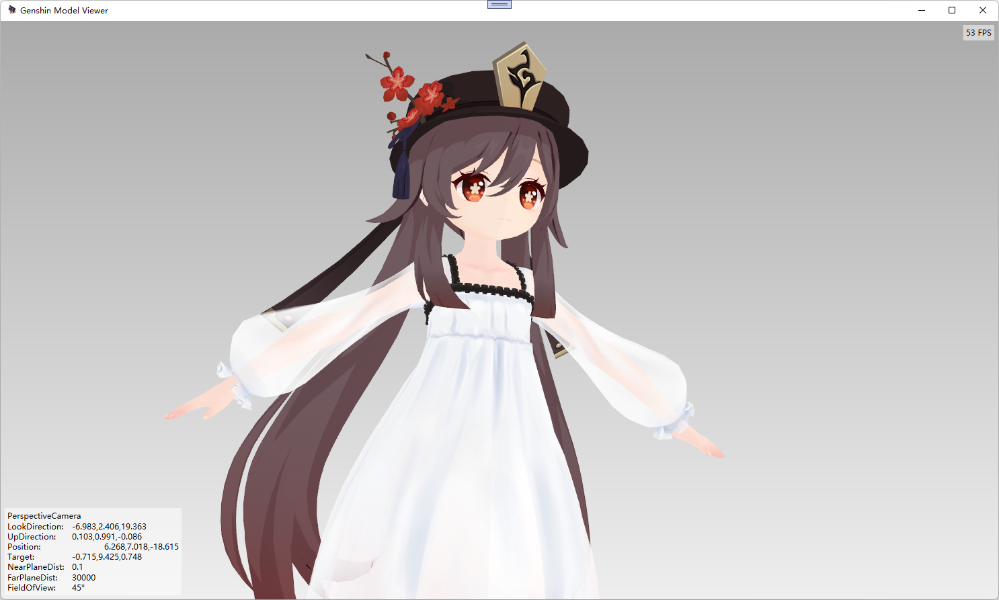

・[English](README.en.md) ・[中文](README.md) ・[日本語](README.jp.md)

#  原神模型预览器

同时亦支持其他PMX格式DMM模型的预览。

> 特性：支持任意旋转平移！支持穿模！

## 模型格式

> 支持模型文件格式： `*.pmx` `*.7z` `*.zip` 

※归档类型将自动非解压方式导入首个`*.pmx`文件

> 支持贴图格式：`*.png` `*.bmp` `*.dds` `*.tga` 等

[模型下载](https://www.aplaybox.com/u/680828836)

## 使用方法

> 点击选择模型文件或将文件拖拽到窗口里。

| 操作源   | 效果                              |
| -------- | --------------------------------- |
| 鼠标左键 | 按住拖拽**平移**                  |
| 鼠标中键 | 按住拖拽**平移** 滚轮上下**缩放** |
| 鼠标右键 | 按住拖拽**旋转**                  |

## 运行环境

`Win10 x64` `.NET 6`

## 程序下载

> 下载页：https://github.com/emako/genshin-model-viewer/releases
>
> 度盘：https://pan.baidu.com/s/1zyV4h6zHmqeWdlbeYyY0-A `7234`

## 开发任务

- [ ] 支持导入文件夹
- [ ] 支持在导入文件夹或归档文件时多个pmx文件则提供选项
- [ ] 支持全屏模式以及重写窗体标题栏
- [ ] 支持交互的按钮

## 常见问题

> 导入模型后发现贴图异常？

- 不支持加入了Sphere算法的贴图，此时将会表现为贴图异常，同时目前原神的官方发布的DMM模型没有使用此类贴图方法，所以原神的模型应该不会有此类问题。

---

欢迎提出[Issues](https://github.com/emako/genshin-model-viewer/issues)

## 更新日志

[CHANGELOG.md](CHANGELOG.md)

## 依赖支持

- [HelixToolkit](https://github.com/helix-toolkit/helix-toolkit)
- [QuickLook.Plugin.HelixViewer](https://github.com/ShiinaManatsu/QuickLook.Plugin.HelixViewer)

- [Pfim](https://github.com/nickbabcock/Pfim)

- [SevenZipSharp](https://github.com/squid-box/SevenZipSharp)
- [7-Zip](https://www.7-zip.org/)

## 许可证

[LICENSE](LICENSE)

